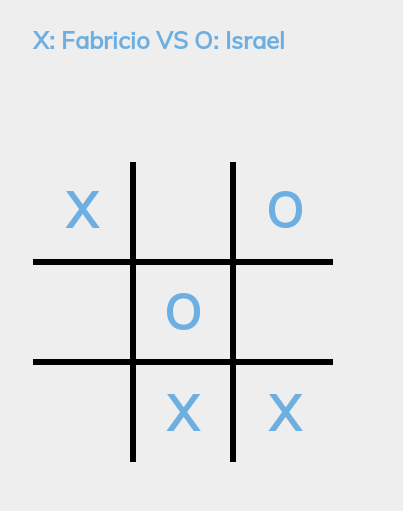
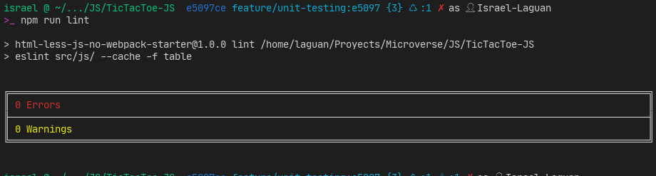

<!-- PROJECT SHIELDS -->
<!--
*** "reference style" links are used for readability.
*** Reference links are enclosed in brackets [ ] instead of parentheses ( ).
*** See the bottom of this document for the declaration of the reference variables
*** for contributors-url, forks-url, etc. This is an optional, concise syntax you may use.
*** https://www.markdownguide.org/basic-syntax/#reference-style-links
-->

[![Contributors][contributors-shield]][contributors-url]
[![Forks][forks-shield]][forks-url]
[![Stargazers][stars-shield]][stars-url]
[![Issues-open][issues-open-shield]][issues-open-url]
[![Issues-closed][issues-closed-shield]][issues-closed-url]

<!-- PROJECT LOGO -->
 

  

  <h1 align="center">
	Tic-Tac-Toe Game
  </h1>

  

    A a Tic Tac Toe game you can play in your browser!
     
	  🖊️
    <a href="https://www.theodinproject.com/courses/javascript/lessons/tic-tac-toe-javascript">Assigment</a>
    🐞
    <a href="https://github.com/fabricio-garcia/tic-tac-toe-js/issues">Report a Bug</a>
    🙋‍♂️
    <a href="https://github.com/fabricio-garcia/tic-tac-toe-js/issues">Request Feature</a>
  

# Specifications

- Data Structures
- Object Oriented Programming
- Factory Functions
- Module Pattern

# Features

- Basic VanillaJS app with a single script or few commands
- LESS ready project ready to use with all its benefits
- JS modules and ES6+ available for most browsers
- Sets `stickler` on the repo
- Sets `eslint` rules
- Tests made with [`ESLint`](https://eslint.org/)

# Built With

- `LESS`
- `ESLint`
- `npm`
- `vscode` with _ESLint_ extension
- Linux/GNU
- Love and Passion for code

# Live Demo

[Link](https://raw.githack.com/Israel-Laguan/TicTacToe-JS/685a73692cfe12b597d806636ed956cad2393b63/index.html)

# Usage

- Clone or download the repo
- Run a live server from the main directory
- Start playing

# Automated tests

# Author

👨 [Fabricio Garcia](https://github.com/fabricio-garcia)

# 🤝 Contributing

Contributions, issues and feature requests are welcome!

# 🤗 Show your support

Give a ⭐️ if you like this project!

# 🏅 Acknowledgements

Give a ⭐️ if you like this project!

- [Microverse](https://www.microverse.org/)
- [The Odin Project](https://www.theodinproject.com/)

# 📝 License

This project is licensed under the Apache License 2.0\
Feel free to fork this project and improve it

<!-- MARKDOWN LINKS & IMAGES -->
<!-- https://www.markdownguide.org/basic-syntax/#reference-style-links -->

[contributors-shield]: https://img.shields.io/github/contributors/fabricio-garcia/tic-tac-toe-js?style=plastic
[contributors-url]: https://github.com/fabricio-garcia/tic-tac-toe-js/graphs/contributors
[forks-shield]: https://img.shields.io/github/forks/fabricio-garcia/tic-tac-toe-js?style=plastic
[forks-url]: https://github.com/fabricio-garcia/tic-tac-toe-js/network/members
[stars-shield]: https://img.shields.io/github/stars/fabricio-garcia/tic-tac-toe-js?style=plastic
[stars-url]: https://github.com/fabricio-garcia/tic-tac-toe-js/stargazers
[issues-open-shield]: https://img.shields.io/github/issues/fabricio-garcia/tic-tac-toe-js?style=plastic
[issues-closed-url]: https://github.com/fabricio-garcia/tic-tac-toe-js/issues
[issues-closed-shield]: https://img.shields.io/github/issues-closed/fabricio-garcia/tic-tac-toe-js?style=plastic
[issues-open-url]: https://github.com/fabricio-garcia/tic-tac-toe-js/issues
